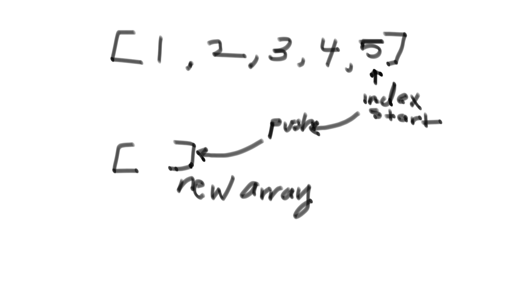

### Reverse an Array ###

Write a function called reverseArray which takes an array as an argument. Without utilizing any of the built-in methods available to your language, return an array with elements in reversed order.

### Whiteboard Process ### 

### _Problem Domain_  ###
Say for instance that an array looks like this: [1,2,3,4,5,6,7,8,9,10] 
I want to make this array into this: [10,9,8,7,6,5,4,3,2,1] 
In other words, I would like to reverse an array to have the last index become the first and so on. 

### _Visual_ ### 
A solution that I can think of right off the top of my head is to create another array, and index the original array in a decrementing pattern-  starting from the last index. Each index will then push into the new array. With that, the new array will result with a reversed order from the original array. 

### _Algorithim_ ###
The solution will be done through a for loop. For the solution I will have the given array with whatever length. I will have another new array that is empty for the time being. I will have a for loop that will decrement instead of increment. I will push each of the looped original array, into the new array that I created to make a reversed array. 

### _bigO_ ###
BigO notation more information: https://www.youtube.com/watch?v=D6xkbGLQesk&t=5s

### _Pseudo Code_ ###
// INPUT ordered array or given array 
// OUTPUT ordered array that is reversed 

given_array = [1,2,3,4,5....]
new_array = []

for each i in given array 
push to new_array 
return new_array 

### _Code_ ###
const numArray = [1,2,3,4,5]; 
const newArray = []; 

const reverseArray = () => {
    for(let i = numArray.length -1; i > -1; i--){
        newArray.push(numArray[i]);
    }
    return newArray; 
}

### _Test_ ###  

