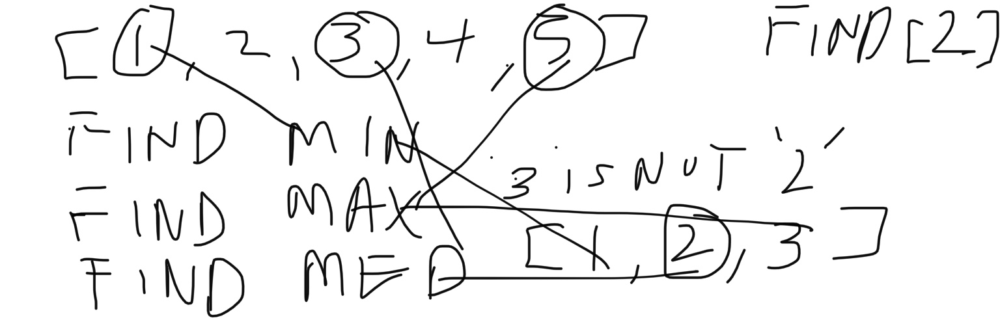

# Insert to Middle of an Array
Write a function called BinarySearch which takes in 2 parameters: a sorted array and the search key. Without utilizing any of the built-in methods available to your language, return the index of the array’s element that is equal to the value of the search key, or -1 if the element is not in the array.

## Whiteboard Process
### _Problem Domain_  ###
Write a function that will find the given value's index in the given array without using the sequential search method.

### _Visual_ ### 

### _Algorithim_ ###
To use the binary search, we will need to find the min value of the array and the max value of the array and then determine the middle value of the array. if the middle value of the sorted array is less than the given value to find then we know that the value will be in the lower half of the given array - and vice versa when it is greater than the middle value. So then we find the min, max and median of the new halfed array and repeat the process until we find the given value. 

## Approach & Efficiency
### _Pseudo Code_ ###
function that has (the array, low value, high value, target value)

if the low value is greater than the high value, return -1. 

initialize a variable to find the middle value  by low value + high value / 2

if the target is equal to the mid value return the mid

else if the target value is less than the mid value return the 2nd half function (the array, low value, mid value -1, target value)

else if the target is larger than the target value return the 1st half function (the array, mid value +1, high value, target)

### _Code_ ###

let binarySearchArray = (array, low, high, target) => {
    if(low > high){
        return -1;
    }
    let mid = Math.floor((low+ high)/2);
    if(target === array[mid]){
        return mid;
    }
    else if(target < array[mid]){
        return binarySearchArray(array, low, mid -1, target)
    }else {
        return binarySearchArray(array, mid +1, target);
    }
}
### Big O ### 

The bigO for this function is O(logn) because the size of the data is cut in half every iteration that it runs. 

