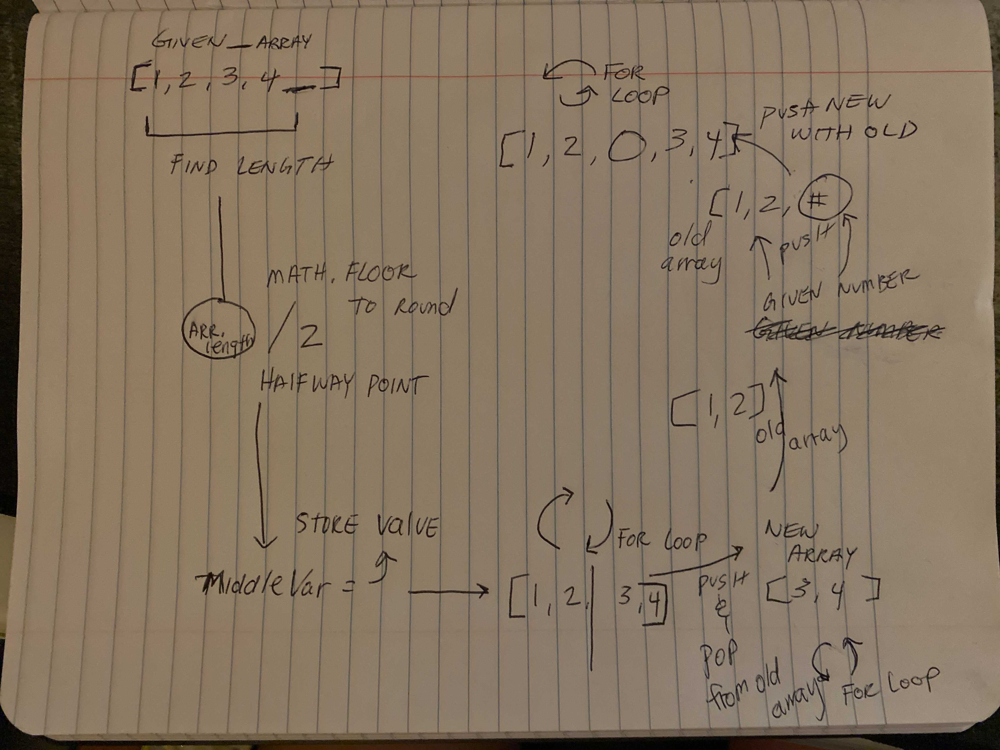

# Insert to Middle of an Array

Write a function called insertShiftArray which takes in an array and a value to be added. Without utilizing any of the built-in methods available to your language, return an array with the new value added at the middle index.

## Whiteboard Process
### _Problem Domain_  ###
Given an array and a numbe - the number needs to be placed in the center index within the array.
For instance:

[2,4,6,-8], 5   =>  [2,4,*5*,6,-8]

[42,8,15,23,42], 16   =>  [42,8,15,*16*,23,42]

### _Visual_ ### 

### _Algorithim_ ###
The thought process I went through was to utilize two arrays, and three for loops. Firstly, we will determine the center index point within the given array. To do this, we simply divide by 2 and remember the length -1 to account for the 0 in the array index. Then we store that value to use in our for loops. The first for loop will be to get all the numbers from the center point index that we just calculated and then push it into another array. Now we can use another for loop to pop or delete the numbers that are beyond the center point. From here, we can push the given number to put into our array's center index. Then we will use the last for loop to push the new array items back into the old array.

## Approach & Efficiency
          ### _Pseudo Code_ ###

          given_array = [1,2,3,4,5...]
          new_array = []

          the function {
              middleValue = Math.floor((given_array.length - 1) /2);
              singledOutValue = given_array[middleValue];
              for(index = value; index < given_array.length; index ++){
              new_array.push(given_array[index])
              }
              for(index = given_array.length; index > singledOutValue; i --) {
              given_array.pop();  
              }
              given_array[singledOutValue] = given_Number;
              for(index = 0; index < new_array.length; index++){
              given_array.push(new_array[index])
              }
          }
          ### _Code_ ###

          In JavaScript: 

          var arr = [1,2,3,4]; // sample array can be any size even or odd 
          var newArr = [];  // new array for later use 

          const middleNumber = () => { // function 

          var theMiddle = Math.floor((arr.length -1) / 2); // divide by 2 to find the center point of an array - dont forget about index 0 

          var value = arr[theMiddle]; // that center index value will be stored 

              for(let i = value; i<arr.length; i++){ // this for loop will go from center point and beyond to push into new array 
                  newArr.push(arr[i]); 
              }
              for(let i = arr.length; i > value; i--){ // this for loop will pop the last values from last to center
                  arr.pop() 
              }
          arr[value] = 15; // push the given number (this is a sample number) to the center point index

              for(let i = 0; i < newArr.length; i++){ // push the saved values that was pushed into new array back to original array 
                  arr.push(newArr[i]);
              }
          }

