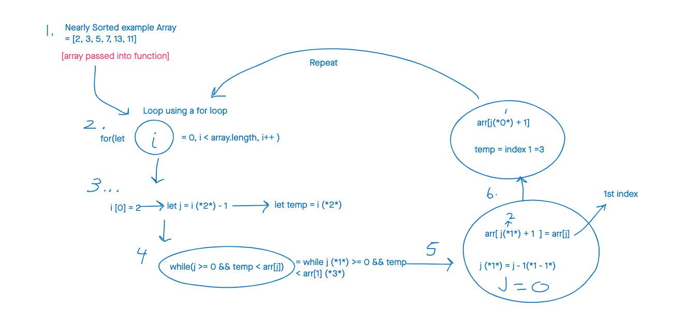

# Pseudocode

    InsertionSort(int[] arr)

    FOR i = 1 to arr.length

      int j <-- i - 1
      int temp <-- arr[i]

      WHILE j >= 0 AND temp < arr[j]
        arr[j + 1] <-- arr[j]
        j <-- j - 1

      arr[j + 1] <-- temp

## For your own understanding, consider also stepping through these inputs:

* Reverse-sorted: [20,18,12,8,5,-2]
* Few uniques: [5,12,7,5,5,7]
* Nearly-sorted: [2,3,5,7,13,11]

## Implementation

* Provide a visual step through for each of the sample arrays based on the provided pseudo code
* Convert the pseudo-code into working code in your language
* Present a complete set of working tests

### _Problem Domain_

Visually show the output of the pseudocode shown above. 

### _Explanation_ 

>*1st line*: function "InsertionSort" will pass in an array

>*2st line*: Using a for loop, start at 1 and loop until we reach the end of the array length, using "i" as the iterator.

>*3nd line*: Integer "j" (or variable) will be equal to each iteration minus 1

>*4rd line*: Integer "temp" (or variable) will be equal to the array's current index

>*5th line*: While "j" is greater than or equal to 0 && (AND) "temp" is less than array[at "j"]

>*6th line*: array[at "j" plus 1] will become array [at "j"]

>*7th line*: "j" will equal "j" minus 1

 >*8th line*: array [at "j" plus 1] will then equal to "temp"  

# Visual

