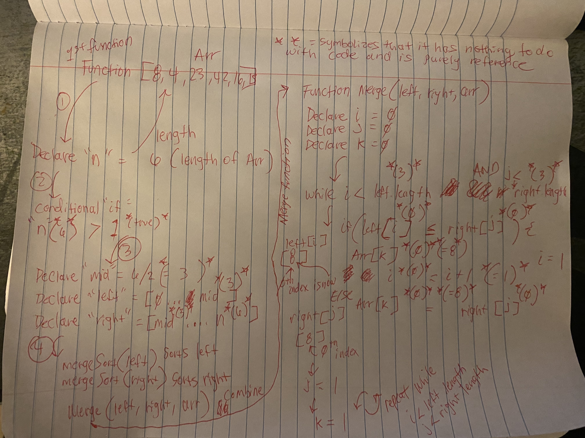

# Pseudocode

    ALGORITHM Mergesort(arr)
        DECLARE n <-- arr.length

        if n > 1
        DECLARE mid <-- n/2
        DECLARE left <-- arr[0...mid]
        DECLARE right <-- arr[mid...n]
        // sort the left side
        Mergesort(left)
        // sort the right side
        Mergesort(right)
        // merge the sorted left and right sides together
        Merge(left, right, arr)

    ALGORITHM Merge(left, right, arr)
        DECLARE i <-- 0
        DECLARE j <-- 0
        DECLARE k <-- 0

        while i < left.length && j < right.length
            if left[i] <= right[j]
                arr[k] <-- left[i]
                i <-- i + 1
            else
                arr[k] <-- right[j]
                j <-- j + 1

            k <-- k + 1

        if i = left.length
        set remaining entries in arr to remaining values in right
        else
        set remaining entries in arr to remaining values in left
    

## For your own understanding, consider also stepping through these inputs:

In your blog article, visually show the output of processing this input array:

[8,4,23,42,16,15]

For your own understanding, consider also stepping through these inputs:

* Reverse-sorted: [20,18,12,8,5,-2]
* Few uniques: [5,12,7,5,5,7]
* Nearly-sorted: [2,3,5,7,13,11]

## Implementation

* Provide a visual step through for each of the sample arrays based on the provided pseudo code
* Convert the pseudo-code into working code in your language
* Present a complete set of working tests

### _Problem Domain_

Visually show the output of the pseudocode shown above. 

### _Explanation_ 

>*1st line*: Function is declared and an array is passed in

>*2st line*: Create Variable "n" as the array length

>*3rd line*: if varibale "n" is greater than 1 

>*4th line*: Create variable "mid" and mid becomes "n" / 2

>*5th line*: Create varibale "left" and "left" becomes array @ 0 to mid

>*6th line*: Create varibale "right" and "right" becomes array @ mid to "n"

>*7th line*: Recursive function "MergeSort" passes in varibale "left" and sorts the left

 >*8th line*: Recursive function "MergeSort" passes in variable "right" and sorts the right

 >*9th line*: Function "Merge" will pass in varibles "left, right, and the array" and merges left and right together

>*10th line*: Function is declared for "Merge" with "left, right, and array" passed in 

>*11th line*: Create Variable "i" to be equal to 0 

>*12th line*: Create Variable "j" to be equal to 0

>*13th line*: Create Varibale "k" to be equal to 0

>*14th line*: while variable "i" is less than "left" length && variable "j" is less than "right" length

>*15th line*: if "left" at "[i]" is less than or equal to "right" at "[j]"

>*16th line*: array at "[k]" is equal to "left" at "[i]"

>*17th line*: "i" equals "i" + 1

>*18th line*: else, array at "[k]" will equal "right" at "[j]" 

>*19th line*: "j" equals "j" + 1

>*20th line*: "k" is equal to "k" + 1

>*21st line*: if "i" is equal to the length of "left"

>*22nd line*: then anything left in the array will be added into the "right" array

>*23rd line*: else anything left in the array will be added to the "left" array 

# Visual

