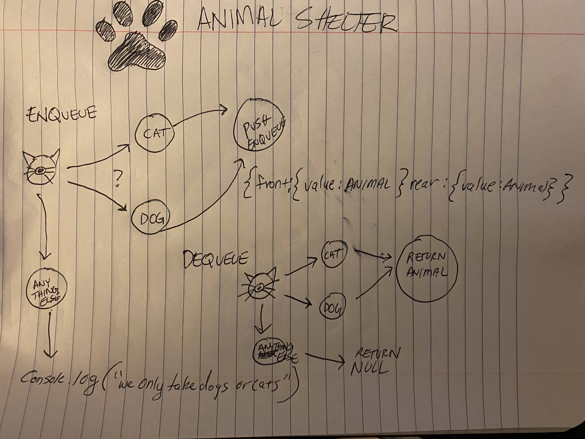

# Stacks and Queues

# Challenge
Create a class called AnimalShelter which holds only dogs and cats.
The shelter operates using a first-in, first-out approach.
Implement the following methods:
enqueue
Arguments: animal
animal can be either a dog or a cat object.
dequeue
Arguments: pref
pref can be either "dog" or "cat"
Return: either a dog or a cat, based on preference.
If pref is not "dog" or "cat" then return null.
## Animal Shelter
### Enqueue 
To enqueue a dog or cat into the queue or animal shelter, the first step is to compare the passed in value to check whether it is a cat or a dog. If it is not a cat or a dog, I will return either a console log saying that it is not a cat or dog, or we can simply return null. 
If it is a cat or dog, we will push it into the animal shelter using the Enqueue method from the previous challenges.
### Dequeue 
To dequeue a dog or a cat and return either a dog or a cat depending on preference or passed in value, we need to check whether the value is a cat or a dog. If it is neither, we will return null. If it is a dog or a cat we will return whichever animal.

## Approach & Efficiency

For Enqueue I will create a new node for the front of the queue as well as the rear to create a queue.

For Dequeue, just like I did with the stack, I will assign a temp varibale to the front of the node and then assign it to null. Afterwards the next node will become the front of the queue. The rear can then be assigned to the front if the front is null. Then we can assign the rear as null.

All of the solutions will be in O(1) or constant time - this is not a growing list, nor will there be deviating steps that will cause a linear time, or O(N) as well as O(n2). 

