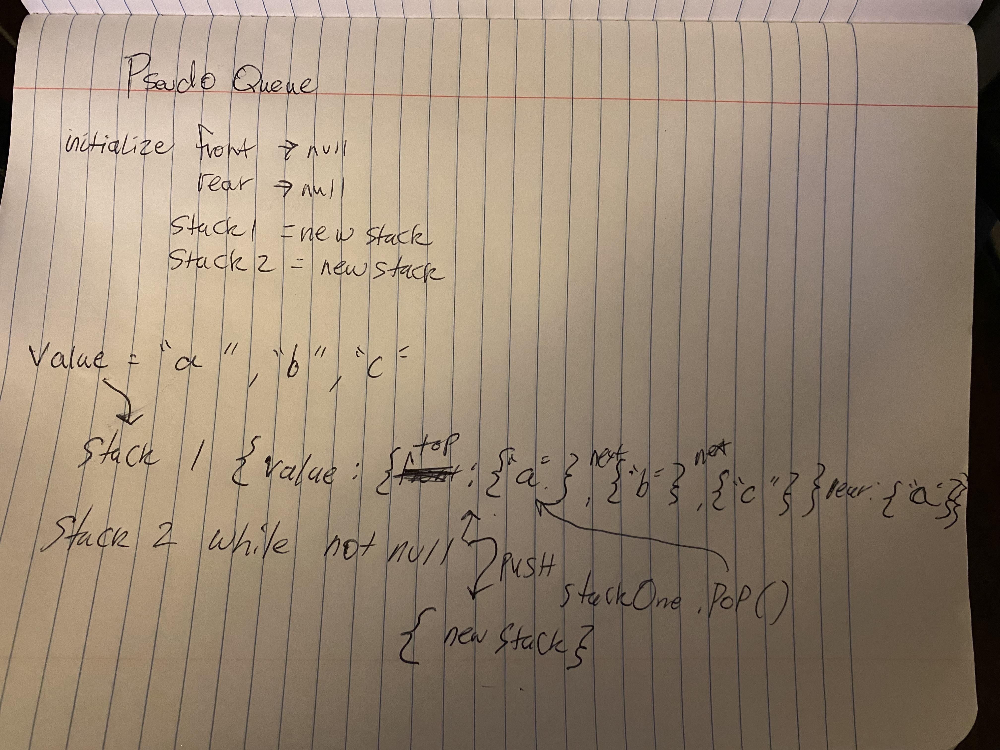

# Stacks and Queues

# Challenge 11 
## Pseudo Queue
Create a new class called pseudo queue.
Do not use an existing Queue.
Instead, this PseudoQueue class will implement our standard queue interface (the two methods listed below),
Internally, utilize 2 Stack instances to create and manage the queue
### Enqueue 
inserts a value into the pseudo queue using the first in first out approach - utlizing the enqueue method brought in from the stacks.js. 
I will use the push method to push the value into the first stack and allow the top of the stack to equal the rear. 
### Dequeue 
this method utilized from the stacks.js will extract a value from the pseudo queue using the first in first out approach. Using a while loop and as long as the initial stack is not null, there will be a second stack that will push the popped value from the initial stack. Then it will return the popped value.

## Approach & Efficiency

this will have a constant time or O(1);

