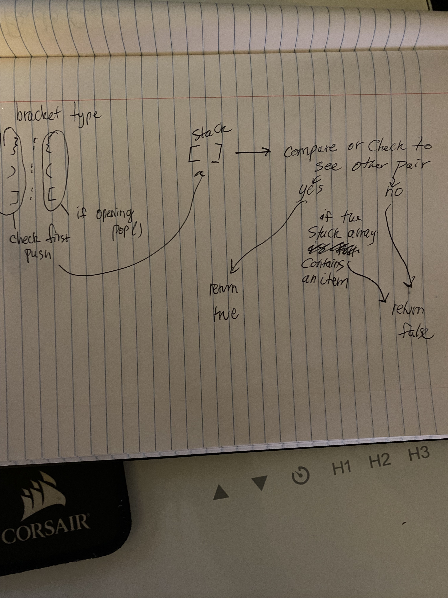

# Stacks and Queues brackets 

# Challenge
Write a function called validate brackets
Arguments: string
Return: boolean
representing whether or not the brackets in the string are balanced
There are 3 types of brackets:

Round Brackets : ()
Square Brackets : []
Curly Brackets : {}

## Approach & Efficiency

function validateBrackets will be passed a string value which will then be compared to see if the brackets in string value all of matching bracket pairs. If there is even one bracket that does not have a pair, the function will return false. If all brackets as string value is matching then the function will return a true boolean. 

Start off the function by instantiating bracket type, which will contain each type of brackets with its corresponding pairs. This variable "bracketType" will hold keys and have the other value bracket to compare against. A stack is also initialized as an array so that if the string character begins with the opening bracket types, it will be pushed into the array. If the string value has a closing bracket type, than it will be popped off the stack and the loop will break and compared using the bracket type keys of corresponding values, and it will retun true or false depending on a match.

