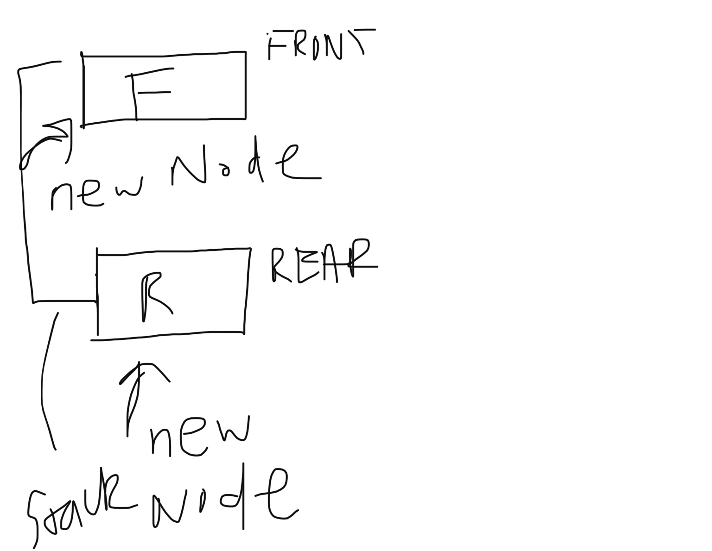
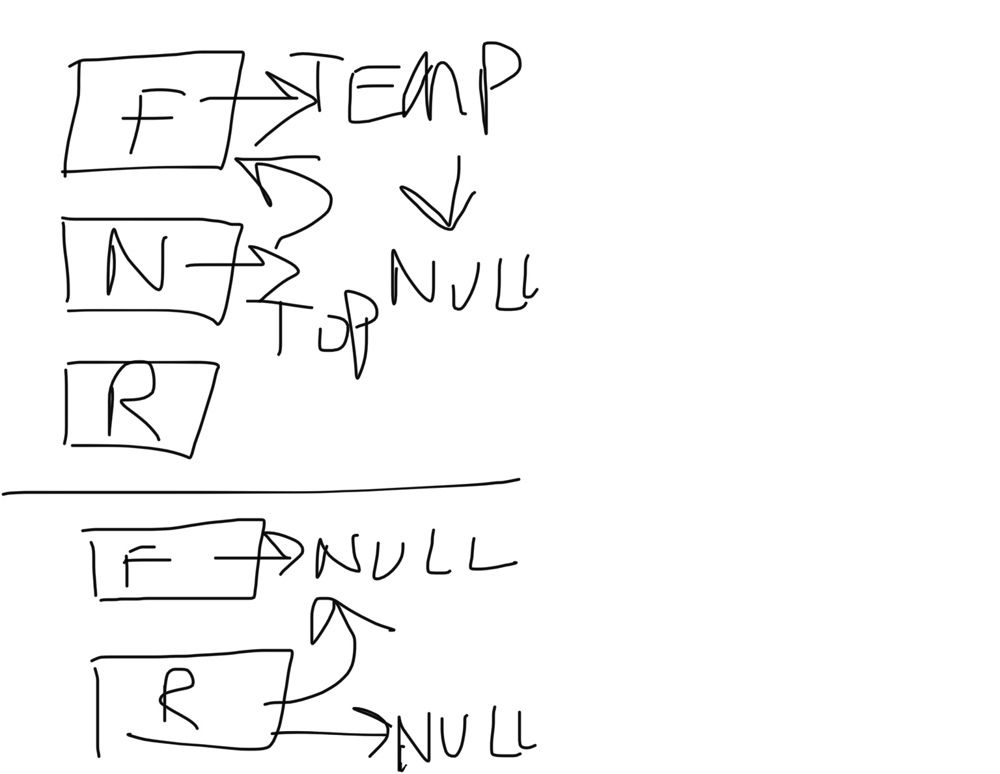

# Stacks and Queues

# Challenge
## Stacks
### Push
push
Arguments: value
adds a new node with that value to the top of the stack with an O(1) Time performance.
### Pop
pop
Arguments: none
Returns: the value from node from the top of the stack
Removes the node from the top of the stack
Should raise exception when called on empty stack
### Peek
peek
Arguments: none
Returns: Value of the node located at the top of the stack
Should raise exception when called on empty stack
### isEmpty
is empty
Arguments: none
Returns: Boolean indicating whether or not the stack is empty.
## Queue 
### Enqueue 
enqueue
Arguments: value
adds a new node with that value to the back of the queue with an O(1) Time performance.
### Dequeue 
dequeue
Arguments: none
Returns: the value from node from the front of the queue
Removes the node from the front of the queue
Should raise exception when called on empty queue
### Peek
peek
Arguments: none
Returns: Value of the node located at the front of the queue
Should raise exception when called on empty stack
### isEmpty
is empty
Arguments: none
Returns: Boolean indicating whether or not the queue is empty
## Approach & Efficiency

For Push I will create a new node and then push it on to the top of the stack, using the method `push`.
For Pop I will create initialize temp variable and then assign the top value of the stack to the new varibale. Then I will assign the next node within the stack to be the top and then assign the temp variable as null.
For peek, I can simply return the top value of the stack as long as it is not null. 
For is Empty, I will use boolean to check to see if there is anything on the top of the stack. If there is, it will return true, if there isn't it will return false.

For Enqueue I will create a new node for the front of the queue as well as the rear to create a queue.
For Dequeue, just like I did with the stack, I will assign a temp varibale to the front of the node and then assign it to null. Afterwards the next node will become the front of the queue. The rear can then be assigned to the front if the front is null. Then we can assign the rear as null.

All of the solutions will be in O(1) or constant time - this is not a growing list, nor will there be deviating steps that will cause a linear time, or O(N) as well as O(n2). 

Enqueue: 

